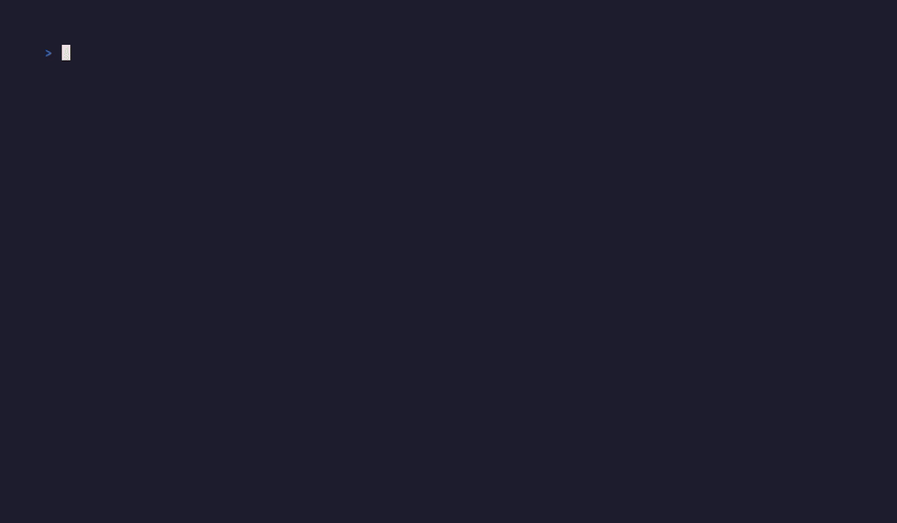

# 🦆 duck

A terminal UI for Docker: live container tree, aggregated stack logs, and interactive exec — event-driven, no polling.

[](https://pkg.go.dev/github.com/sonirico/duck)
[](LICENSE)
[](go.mod)


## Features

- **Event-driven**: watches the Docker events API for container state changes. No polling loop.
- **Stacks as first-class citizens**: containers are grouped by `com.docker.compose.project` / `com.docker.compose.service` labels, so a compose stack shows as a tree, not a flat list.
- **Aggregated live logs**: select a stack to follow every container's logs in one merged, color-coded-per-container stream (via [`sonirico/vago/streams`](https://github.com/sonirico/vago)).
- **Interactive exec with native tmux integration**: press `e` on a container to open a shell. Inside tmux >= 3.2 it opens a popup, >= 3.0 a split pane, otherwise it falls back to an inline `docker exec`.
- **Correct stdout/stderr demuxing**: logs are demultiplexed with `stdcopy`, so non-TTY containers render cleanly.

## Aggregated logs


## Exec



## Install

```sh
go install github.com/sonirico/duck@latest
```

Or build from source:

```sh
git clone https://github.com/sonirico/duck.git
cd duck
just build
```

## Keybindings

| Key       | Context     | Action                    |
|-----------|-------------|----------------------------|
| `j` / `k` | container list | move selection          |
| `g` / `G` | container list | jump to top / bottom     |
| `tab`     | anywhere    | switch focus between list and logs |
| `e`       | container list | open an interactive shell in the selected container |
| `q`       | anywhere    | quit                      |
| `j` / `k` | logs panel  | scroll                    |
| `g`       | logs panel  | jump to top, stop following |
| `G`       | logs panel  | jump to bottom, resume following |

## Development

```sh
just build      # go build
just test       # go test ./...
just check      # build, vet, test, gofmt -l
just fmt        # gofmt -w
just smoke       # ./scripts/smoke.sh
just demo-up     # start a synthetic demo stack with docker run
just demo-down   # tear it down
just record      # build, start the demo stack, re-render every vhs/*.tape, tear it down
```

The demo stack (`scripts/demo.sh`) runs a handful of Alpine/BusyBox containers with fake compose labels, so the GIFs in `docs/vhs/` can be re-recorded with `just record` without a real application behind them.

## Requirements

- A running Docker daemon.
- tmux (optional) — enables the popup/split exec integration; without it, exec falls back to an inline shell.

## License

[MIT](LICENSE)
